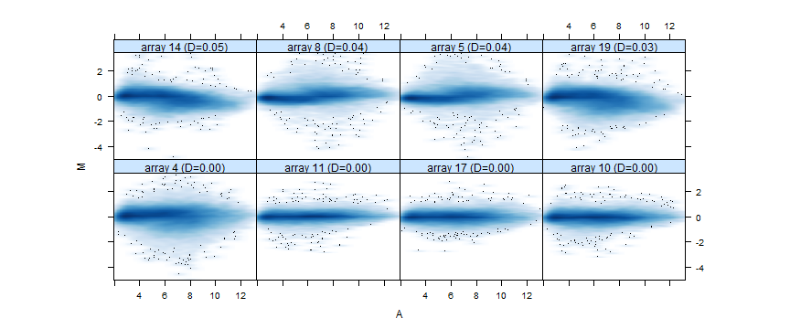
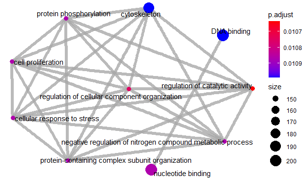
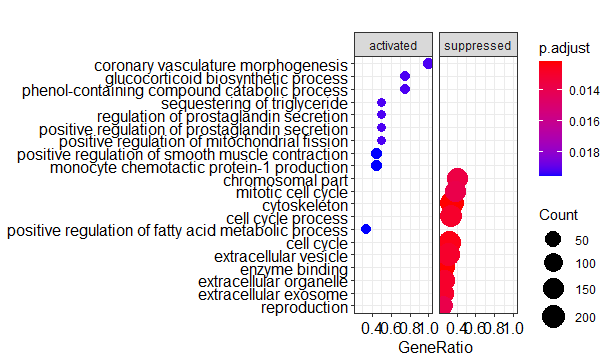

```{r setup, include=FALSE}
knitr::opts_chunk$set(echo = TRUE)
```

#ABSTRACT#

<div style="text-align: justify">La implantación de los embriones es crucial para establecer un embarazo y requiere la interacción y sincronización entre el endometrio del útero y el embrión. Esto implica la activicion e inactivación de numerosas moléculas de señalización que pueden influir en la proliferación y diferenciación de las células epiteliales uterinas, polaridad epitelial, cierre luminal, orientación embrionaria, interacciones epiteliales-estromales, desarrollo de glándulas, etc. 
La progesterona, hormona secretada por el cuerpo lúteo tras la ovulación y durante toda la segunda mitad del ciclo menstrual, es clave para inducir la receptividad endometrial y favorecer la implantación del embrión en el endometrio. [1][2]
Los diferentes niveles de progesterona y su tiempo de exposición dan como resultado diferentes expresiones de genes endometriales y, consecuentemente, diferencias en el potencial de implantación.<div/> 

---

#OBJETIVOS#

<div style="text-align: justify">El objetivo de este estudio es realizar un análisis de microarrays para observar la influencia que tiene el tratamiento con progesterona y el tiempo de exposición a ella en la expresión de los diferentes genes en el endometrio. Así, se podrá determinar si un suministro extra de progesterona o una mayor exposición a ésta tras el momento de la fecundación favorece la implantación del embrión al útero.<div/> 

---

#MATERIALES Y MÉTODOS#

##Materiales##

###Datos###

<div style="text-align: justify">Este análisis se aplica en un conjunto de datos de un estudio publicados por Suthaporn et al. [3] Los datos fueron subidos a la base de datos _Gene Expression Omnibus_ (GEO). El conjunto de datos seleccionado se identifica con el siguiente número de acceso: GSE146777. 

El experimento se basa en la comparación de diferentes muestras sin o con aporte extra de progesterona en diferentes cantidades (0.1 microM, 1 microM y 10 microM) durante un tiempo de exposición de tres, siete u once días. Así pues, el diseño del análisis es de dos factores (aporte de progesterona y tiempo de exposición) con cuatro niveles para la progesterona (sin aporte extra, aporte de 0.1 microM, aporte de 1 microM y aporte de 10 microM) y con tres niveles para el tiempo de exposición (tres días, siete días y once días). 

El experimento cuenta con 24 muestras, con tres réplicas para cada grupo: tres muestras sin aporte de progesterona durante tres días, tres muestras sin aporte de progesterona durante siete días, tres muestras sin aporte de progesterona durante once días, tres muestras con aporte de 1 microM de progesterona durante tres días, tres muestras con aporte de 0.1 microM de progesterona durante siete días, tres muestras con aporte de 1 microM de progesterona durante siete días, tres muestras con aporte de 10 microM de progesterona durante 7 días y tres muestras con aporte de 1 microM de progesterona durante 11 días. 

Existe un archivo .CEL para cada muestra, el cual incluye la información sobre el microarray chip correspondiente. Estos datos son de bajo nivel, puesto que son los datos binarios proporcionados por el escáner. Estos datos tendrán que pasar un control de calidad y someterse a un procesado de sumarización y normalización para pasar a ser datos de alto nivel, con los cuales ya se podrán realizar los posteriores análisis.<div/> 

###Array###

<div style="text-align: justify">El array utilizado en este estudio es [Clariom_S_Human] Affymetrix Clariom S Assay, Human (Includes Pico Assay).<div/>

##Métodos##


###Directorio y opciones de trabajo###

<div style="text-align: justify">Se escoge un directorio de trabajo y los datos (archivos en formato .CEL) se copian en un subdirectorio del anterior denominado _data_, mientras que también se crea otro subdirectorio denominado _results_ dónde se almacenarán los resultados.<div/>

###Obtención de los datos###

<div style="text-align: justify">Los datos se obtienen mediante la descarga de los archivos almacenados en el estudio GSE146777 de la página de GEO (https://www.ncbi.nlm.nih.gov/geo/query/acc.cgi?acc=GSE146777). En concreto, se trata de 24 archivos .CEL (uno para cada muestra).

También se prepara el archivo _targets_, el cual contiene información sobre los diferentes grupos y covariables. Es decir, este archivo relaciona el nombre de cada archivo .CEL con las covariables y el grupo al cual pertenece. Estará formado por las siguientes columnas:

- _FileName_: nombre del archivo que contiene la muestra.

-	_Group_: grupo al cual pertenece la muestra. 

-	_Timing_: tiempo durante el cual la muestra ha sido sometida al estudio. 

-	_Levels_: niveles de progesterona a los cuales ha sido sometida la muestra durante el tratamiento. 

-	_ShortName_: nombre abreviado de la muestra, compuesta por su grupo y el número de muestra dentro de este grupo. 

Este archivo _targets_ ha sido guardado en formato .csv, con los datos separados por punto y coma. 

La siguiente tabla muestra el contenido de este archivo _targets_. <div/>

```{r echo = FALSE}
targets <- read.csv2("./data/targets.csv", header = TRUE, sep = ";")
```

```{r echo = FALSE}
library(knitr)
knitr::kable(
targets, booktabs = TRUE, 
caption = 'Tabla 1. Contenido del archivo targets')
```

###Lectura de los datos###

A continuación, se procede a realizar la lectura de los archivos .CEL. Para ello, se usa el paquete _oligo_ y las funciones _list.celfiles_, _read.AnnotatedDataFrame_ y _read.celfiles_. 

```{r include = FALSE}
library(oligo)
celFiles <- list.celfiles("./data", full.names = TRUE)
library(Biobase)
my.targets <-read.AnnotatedDataFrame(file.path("./data","targets.csv"), 
                                     header = TRUE, row.names = 1, 
                                     sep=";")
rawData <- read.celfiles(celFiles, phenoData = my.targets)
```

```{r include = FALSE}
my.targets@data$ShortName->rownames(pData(rawData))
colnames(rawData) <-rownames(pData(rawData)) 
head(rawData)
```

###Exploración y visualización de los datos###

<div style="text-align: justify">Una vez leídos todos los datos, se procede a realizar el preprocesado de éstos, con la finalidad de observar el resultado del experimento mediante la realización de gráficos, la realización de un control de calidad de los datos y su normalización para el posterior análisis. 
Es importante que los datos sean de calidad y no tengan demasiado ruido, para poder llevar a cabo la normalización de una manera correcta. 

Para ello, se usa el paquete _ArrayQualityMetrics_, el cual realiza un estudio de la calidad de los datos y muestra algunos gráficos básicos para mostrarla, como pueden ser los diagramas de caja y los gráficos PCA (_Principal Component Analysis_). 

También muestra una tabla resumen con los resultados de este estudio. Las columnas *1, *2 y *3 de la figura 1 corresponden a los distintos métodos de detección, siendo los siguientes:

- Detección de _outliers_ mediante 'Distancia entre arrays'
- Detección de _outliers_ mediante 'Boxplots'
- Detección de _outliers_ mediante 'MA plots'

Si un array está por encima de un determinado umbral, se marca con una X y es identificado como _outlier_. 

```{r eval = FALSE, echo = FALSE}
library(arrayQualityMetrics)
arrayQualityMetrics(rawData,force=TRUE)
```

```{r echo = FALSE, out.width='75%', fig.align='center', fig.cap='Figura 1. Descripción general del array y detección de outliers'}

```

En la figura 1, se puede observar que el array 2 es identificado como _outlier_ en los tres métodos, los arrays 4, 20 y 22 en dos métodos, y los arrays 5, 6, 8, 13, 14, 16 y 19 en un método. 

A continuación, se profundiza más en el estudio de estos _outliers_ mediante los distintos gráficos producidos. 

__Distancia entre arrays__

```{r echo = FALSE, out.width='75%', fig.align='center', fig.cap='Figura 2. Heatmap de las distancias entre arrays'}

```

La figura 2 muestra un _heatmap_ de las distancias entre arrays. Los patrones en este gráfico pueden indicar la agrupación de los arrays, debida a factores experimentales biológicos o no. La distancia entre dos conjuntos se calcula como la diferencia absoluta media entre los datos de los arrays. La detección de _outliers_ se realiza buscando arrays para los cuales la suma de las distancias a todos los demás arrays es muy grande. Se han detectado tres de estos arrays, los cuales son los arrays 2, 19 y 20 (marcados con un asterisco). 

__Detección de outliers mediante la distancia entre arrays__

```{r echo = FALSE, out.width='75%', fig.align='center', fig.cap='Figura 3. Gráfico de barras de la suma de las distancias a otros arrays'}

```

La figura 3 muestra un gráfico de barras de la suma de las distancias a otros arrays. El umbral determinado es de 5340, indicado mediante una línea vertical. Los arrays que han excedido este umbral y han sido considerados _outliers_ son los arrays 2, 19 y 20. 

__Análisis principal de componentes__

```{r echo = FALSE, out.width='75%', fig.align='center', fig.cap='Figura 4. Diagrama de dispersión de los arrays'}

```

La figura 4 muestra un diagrama de dispersión de los arrays a lo largo de las dos primeras componentes principales. Este gráfico permite observar si hay agrupación de los arrays. Se puede observar que hay un array que está muy separado del resto, teniendo en cuenta la segunda componente principal. 

Este gráfico proporcionado por el paquete _ArrayQualityMetrics_ no proporciona suficiente información acerca del nombre y el grupo del array de la muestra, de manera que se procede a definir una función que proporcione un gráfico con esta información. 


```{r include = FALSE}
library(ggplot2)
library(ggrepel)
plotPCA3 <- function (datos, labels, factor, title, scale,colores, size = 1.5, glineas = 0.25) {
  data <- prcomp(t(datos),scale=scale)
  dataDf <- data.frame(data$x)
  Group <- factor
  loads <- round(data$sdev^2/sum(data$sdev^2)*100,1)
  p1 <- ggplot(dataDf,aes(x=PC1, y=PC2)) +
    theme_classic() +
    geom_hline(yintercept = 0, color = "gray70") +
    geom_vline(xintercept = 0, color = "gray70") +
    geom_point(aes(color = Group), alpha = 0.55, size = 3) +
    coord_cartesian(xlim = c(min(data$x[,1])-5,max(data$x[,1])+5)) +
    scale_fill_discrete(name = "Group")
  p1 + geom_text_repel(aes(y = PC2 + 0.25, label = labels),segment.size = 0.25, size = size) + 
    labs(x = c(paste("PC1",loads[1],"%")),y=c(paste("PC2",loads[2],"%"))) +  
    ggtitle(paste("Principal Component Analysis for: ",title,sep=" "))+ 
    theme(plot.title = element_text(hjust = 0.5)) +
    scale_color_manual(values=colores)
  }
```

```{r echo = FALSE, fig.cap = 'Figura 5. Diagrama de dispersión de componentes principales', fig.align = 'center'}
plotPCA3(exprs(rawData), labels = targets$ShortName, factor = targets$Group,
         title="Raw data", scale = FALSE, size = 3, 
         colores = c("red", "blue", "green", "yellow","orange","pink","purple","brown"))
```

```{r include = FALSE, eval = FALSE}
tiff("figures/PCA_RawData.tiff", res = 200, width = 4.5, height = 4, units = 'in')
plotPCA3(exprs(rawData), labels = targets$ShortName, factor = targets$Group,
         title="Raw data", scale = FALSE, size = 2, 
         colores = c("red", "blue", "green", "yellow","orange","pink","purple","brown"))
dev.off()
```

En la figura 5, se observa que el array _outlier_ pertenece al grupo D7.10 (aporte de 10 microM de progesterona durante siete días). También se observa que la primera componente representa el 31.3% de la variabilidad total de las muestras y la segunda componente representa el 16.1% de la variabilidad total de las muestras. No se puede observar un patrón claro sobre la contribución de las variables. Para ello, se esperará a la normalización de los datos.

__Boxplots__

```{r echo = FALSE, out.width='75%', fig.align='center', fig.cap='Figura 6. Boxplot de la intensidad de señales de los arrays'}

```

La figura 6 muestra un _boxplot_ que representa la intensidad de señal de los arrays. Se espera que las cajas tengan posiciones y anchos similares. Una distribución muy diferente a las demás puede indicar un problema experimental.

En este gráfico, la detección de valores _outliers_ se ha realizado con el estadístico de Kolmogorov-Smirnov entre la distribución de cada array y la distribución de los datos agrupados. 

```{r echo = FALSE, out.width='75%', fig.align='center', fig.cap='Figura 7. Detección de outliers mediante boxplots'}

```

La figura 7 muestra que los arrays detectados como outliers son los arrays 2, 4 y 22.

A continuación, se muestra otro boxplot más visual de la distribución de intensidad de los arrays de todas las muestras. 

```{r echo = FALSE, fig.cap = 'Figura 8. Boxplot de la intensidad de señales de los arrays', fig.align = 'center'}
boxplot(rawData, cex.axis=0.5, las=2,  which="all", 
        col = c(rep("red", 3), rep("blue", 3), rep("green", 3), rep("yellow", 3), rep("orange", 3), rep("pink", 3), rep("purple", 3), rep("brown", 3)),
        main="Distribution of raw intensity values")
```

La figura 8 muestra un boxplot con la distribución de las intensidades de las muestras, organizadas por colores según el grupo al cual pertenecen. Se observan variaciones en la intensidad entre los arrays de las muestras, las más importantes de las cuales coinciden con las observaciones del gráfico anterior, pero es lo que cabe esperar cuando los datos aún no han sido procesados. 

__Gráfico de densidad de la distribución de los arrays__

```{r echo = FALSE, out.width='75%', fig.align='center', fig.cap='Figura 9. Gráfico de densidad de los arrays'}

```

La figura 9 muestra un gráfico de densidad con las distribuciones de los arrays. Se observa que todos los arrays muestran una distribución similar. Si no lo fueran, se podrá considerar que es debido a un problema de calidad.

__Gráfico de densidad de la desviación estándar de las intensidades versus el rango de la media__

```{r echo = FALSE, out.width='75%', fig.align='center', fig.cap='Figura 10. Gráfico de densidad de la desviación estándar de las intensidades versus el rango de la media'}

```

La figura 10 muestra un gráfico de densidad de la desviación estándar de las intensidades (eje Y) versus el rango de la media (eje X). Los puntos rojos muestran la mediana de la desviación estándar, la cual se espera que sea horizontal tras la normalización de los datos.<div/>


###Normalización###

<div style="text-align: justify">El paso siguiente a realizar es la normalización de los datos, mediante la cual se corregirá el ruido de fondo, es decir, toda la variabilidad entre muestras que no sean debidas a razones biológicas (como sesgos debidos a problemas técnicos) y se hará que los valores de los arrays sean comparables entre ellos.

El método utilizado ha sido el _Robust Multichip Analysis_ (RMA). [4]

```{r echo = FALSE, include = FALSE}
eset_rma <- rma(rawData)
```

Una vez aplicado el método RMA, se realiza un control de calidad para comprobar cómo han cambiado los datos. Se usa nuevamente el paquete _ArrayQualityMetrics_ para la visualización de los datos. 

```{r eval = FALSE, echo = FALSE}
arrayQualityMetrics(eset_rma, outdir = file.path("./results", "QCDir.Norm"), force=TRUE)
```

La figura 11 muestra que sólo el array 22 es identificado como _outlier_ por dos métodos y los arrays 14 y 19 por un método. 

```{r echo = FALSE, out.width='75%', fig.align='center', fig.cap='Figura 11. Descripción general del array y detección de outliers'}

```

__Distancia entre arrays__

```{r echo = FALSE, out.width='75%', fig.align='center', fig.cap='Figura 12. Heatmap de las distancias entre arrays'}
knitr::include_graphics('figures/Figura 12.png')
```

La figura 12 muestra el _heatmap_ de las distancias entre arrays tras la normalización. Se observa que los arrays 19 y 22 podrán ser posibles _outliers_, debido a que la suma de las distancias a todos los demás arrays es muy grande. 

__Detección de outliers mediante la distancia entre arrays__

```{r echo = FALSE, out.width='75%', fig.align='center', fig.cap='Figura 13. Gráfico de barras de la suma de las distancias a otros arrays'}

```

La figura 13 muestra el gráfico de barras de la suma de las distancias a otros arrays, con un umbral determinado en 11.8 y representado con una línea vertical. Se detectan como _outliers_ los arrays 19 y 22. 

Los datos anteriores a la normalización mostraban como _outliers_ a los arrays 2, 19 y 20, y tras la normalización los arrays 19 y 22. Así pues, el array 19 es detectado como _outlier_ en ambos casos. 

__Análisis principal de componentes__

```{r echo = FALSE, out.width='75%', fig.align='center', fig.cap='Figura 14. Diagrama de dispersión de los arrays'}

```

La figura 14 muestra el diagrama de dispersión de los arrays a lo largo de las dos primeras componentes principales. Se puede observar que, comparando con el gráfico obtenido antes de la normalización, los arrays se han agrupado de manera distinta. 

Obtenemos otro gráfico de este análisis de componentes principales con más información sobre el grupo de los arrays. 

```{r echo = FALSE, fig.cap = 'Figura 15. Diagrama de dispersión de componentes principales', fig.align = 'center'}
plotPCA3(exprs(eset_rma), labels = targets$ShortName, factor = targets$Group, 
         title="Normalized data", scale = FALSE, size = 3, 
         colores = c("red", "blue", "green",  "yellow", "orange", "pink", "purple", "brown"))
```

En la figura 15 se observa que la primera componente representa el 45.5% de la variabilidad total de las muestras, de manera que ha aumentado con respecto al análisis realizado a los datos sin procesar. Y la segunda componente representa el 19.6% de la variabilidad de las muestras, también aumentando con respecto al primer análisis. Además se observa que, tras la normalización, la segunda componente separa las muestras según se les haya administrado un aporte extra de progesterona o no, situándose arriba las muestras que no han recibido un aporte de progesterona y abajo las muestras que sí han recibo este aporte de progesterona.

__Boxplots__

```{r echo = FALSE, out.width='75%', fig.align='center', fig.cap='Figura 16. Boxplot de la intensidad de señales de los arrays'}

```

La figura 16 es un _boxplot_ dónde las cajas representan la intensidad de los arrays.  

```{r echo = FALSE, out.width='75%', fig.align='center', fig.cap='Figura 17. Detección de outliers mediante boxplots'}

```

La figura 17 detecta como _outliers_, una vez realizada la normalización, los arrays 14 y 22, mientras que previamente a la normalización se detectaron los arrays 2, 4 y 22. Así pues, el array 22 continua siendo un _outlier_ según este método. 


```{r echo = FALSE, out.width='75%', fig.align='center', fig.cap='Figura 18. Boxplot de la intensidad de señales de los arrays'}
boxplot(eset_rma, cex.axis=0.5, las=2,  which="all", 
        col = c(rep("red", 3), rep("blue", 3), rep("green", 3), rep("yellow", 3), rep("orange", 3), rep("pink", 3), rep("purple", 3), rep("brown", 3)),
        main="Boxplot for arrays intensity: Normalized Data")
```

La figura 18 muestra un _boxplot_ que representa la distribución de las intensidades normalizadas de todas las muestras, agrupadas por colores según su grupo. Se observa que todas las cajas muestran un aspecto similar, hecho que nos sugiere que el proceso de normalización ha funcionado bien. Aunque esto es lo esperado, ya que el método RMA incluye un paso llamado normalización cuantil, dónde la distribución empírica de las muestras se establece en los mismos valores.   

__Gráfico de densidad de la distribución de los arrays__

```{r echo = FALSE, out.width='75%', fig.align='center', fig.cap='Figura 19. Gráfico de densidad de los arrays'}

```

La figura 19 muestra un gráfico de densidad con las distribuciones normalizadas de los arrays. Se observa que todas las distribuciones son similares, salvo una que se desvía un poco.

__Gráfico de densidad de la desviación estándar de las intensidades versus el rango de la media__

```{r echo = FALSE, out.width='50%', fig.align='center', fig.cap='Figura 20. Gráfico de densidad de la desviación estándar de las intensidades versus el rango de la media'}

```

La figura 20 muestra el gráfico de densidad de la desviación estándar de las intensidades normalizadas versus el rango de la media. Se observa que la mediana de la desviación estándar, representada por puntos rojos, se asemeja a una línea horizontal, lo cual es lo esperado. 

__Gráfico MA__

```{r echo = FALSE, out.width='100%', fig.align='center', fig.cap='Figura 21. Gráfico MA'}

```

La figura 21 muestra un gráfico MA, en el cual se espera que la masa de distribución se concentre en el eje M=0 y no debería haber una tendencia en función de A. La detección de _outliers_ se realiza mediante el cálculo del estadístico Hoeffding sobre la distribución conjunta de A y M para cada array. Este estadístico puede observarse en los encabezados de cada panel. 

__Detección de outliers mediante el gráfico MA__

```{r echo = FALSE, out.width='75%', fig.align='center', fig.cap='Figura 22. Detección de outliers mediante el gráfico MA'}

```

La figura 22 muestra que ninguno de los arrays ha sido detectado como _outlier_, al no ser el estadístico superior al umbral de 0.15. 

A continuación, se procede a continuar el estudio con todas las muestras, ya que ninguna de ellas, tras el proceso de la la normalización, muestra ser un _outlier_ por tres métodos distintos. <div/>

###Detección de factores batch###

<div style="text-align: justify">Los resultados de los microarrays pueden verse alterados por distintas razones no biológicas, como pueden ser los reactivos de distintos lotes, la manipulación de éstos por varios técnicos o la diferencia en la fecha de procesamiento de las muestras de un mismo experimento. 

A continuación, se realizar el análisis de componentes de variación principal PVCA para identificar y eliminar los efectos de dichos problemas no biológicos. Este análisis analiza las componentes principales y las componentes de la varianza. 

```{r echo = FALSE, include = FALSE}
library(pvca)
pData(eset_rma) <- targets
pct_threshold <- 0.6
batch.factors <- c("Timing", "Levels")
pvcaObj <- pvcaBatchAssess (eset_rma, batch.factors, pct_threshold)
```

```{r echo = FALSE, out.width='75%', fig.align='center', fig.cap='Figura 23. Diagrama de barras con la estimación PVCA'}
bp <- barplot(pvcaObj$dat, xlab = "Effects",
              ylab = "Weighted average proportion variance",
              ylim= c(0,1.1),col = c("mediumorchid"), las=2,
              main="PVCA estimation")
axis(1, at = bp, labels = pvcaObj$label, cex.axis = 0.55, las=2)
values = pvcaObj$dat
new_values = round(values , 3)
text(bp,pvcaObj$dat,labels = new_values, pos=3, cex = 0.5)
```

La figura 24 muestra un diagrama de barras con una barra por cada variable de variación incluida en el estudio. Se observa que la principal fuente de variación en las muestras es la variable _'Levels'_, correspondiente al aporte de progesterona subministrado durante el tratamiento.<div/> 

###Detección de genes más variables###

<div style="text-align: justify">El siguiente paso es determinar qué porcentaje de genes muestra una variabilidad que se puede atribuir a causas que no sean por variación aleatoria, ya que si un gen se expresa de manera diferencial, la varianza general del gen será mayor que la de los genes que no muestran una expresión diferencial. 
Para ello, se representan las desviaciones estándar de los genes, ordenados de menor a mayor. 

```{r echo = FALSE, out.width='75%', fig.align='center', fig.cap='Figura 24. Distribución de la variabilidad de todos los genes'}
sds <- apply (exprs(eset_rma), 1, sd)
sdsO<- sort(sds)
plot(1:length(sdsO), sdsO, main="Distribution of variability for all genes",
     sub="Vertical lines represent 90% and 95% percentiles",
     xlab="Gene index (from least to most variable)", ylab="Standard deviation")
abline(v=length(sds)*c(0.9,0.95))
```

La figura 24 muestra los genes más variables, que son aquellos que tienen una desviación superior al 90-95% de todas las desviaciones estándar. <div/> 

###Filtraje###

<div style="text-align: justify">A continuación se realiza el filtraje, para eliminar aquellos genes que varían poco o lo hacen por variación aleatoria. Es decir, son genes que no se espera que se expresen de manera diferencial. Para ello se usa la función _nsFilter_, la cual elimina este tipo de genes, y el paquete de anotación correspondiente, que en este estudio es _clariomdhumantranscriptcluster.db_. Con ello se obtendrá el _expression set_ y los resultados del filtraje. 

```{r eval = FALSE, include = FALSE, message = FALSE, warning = FALSE}
library(genefilter)
if (!requireNamespace("BiocManager", quietly = TRUE))
    install.packages("BiocManager")
BiocManager::install("clariomdhumantranscriptcluster.db")
library(clariomdhumantranscriptcluster.db)
annotation(eset_rma) <- "clariomdhumantranscriptcluster.db"
filtered <- nsFilter(eset_rma, 
                     require.entrez = TRUE, remove.dupEntrez = TRUE,
                     var.filter=TRUE, var.func=IQR, var.cutoff=0.75,
                     filterByQuantile=TRUE, feature.exclude = "^AFFX")

```

```{r include = FALSE}
library(genefilter)
library(clariomdhumantranscriptcluster.db)
annotation(eset_rma) <- "clariomdhumantranscriptcluster.db"
filtered <- nsFilter(eset_rma, 
                     require.entrez = TRUE, remove.dupEntrez = TRUE,
                     var.filter=TRUE, var.func=IQR, var.cutoff=0.75,
                     filterByQuantile=TRUE, feature.exclude = "^AFFX")
```

```{r echo = FALSE}
print(filtered$filter.log)
```

```{r echo = FALSE}
eset_filtered <-filtered$eset
eset_filtered
```

Después del filtraje, se observa que quedan 4630 genes para analizar.<div/> 

```{r echo = FALSE}
write.csv(exprs(eset_rma), file="./results/normalized.Data.csv")
write.csv(exprs(eset_filtered), file="./results/normalized.Filtered.Data.csv")
save(eset_rma, eset_filtered, file="./results/normalized.Data.Rda")
```

###Matriz de diseño###

<div style="text-align: justify">Una vez está listo el _expression set_, se procede a construir un modelo lineal para seleccionar aquellos genes que están diferencialmente expresados. 

En primer lugar, se crea la matriz de diseño, es decir, una tabla que describa la asignación de cada muestra a una condición experimental. Debe tener tantas filas como muestras y tantas columnas como grupos. Se indica con un 1 si la muestra pertenece al grupo y con un 0 si la muestra no pertenece al grupo.
Para crearla, se usa el paquete _limma_ y la función _model.Matrix_. <div/> 


```{r echo = FALSE, eval = FALSE}
if (!exists("eset_filtered")) load (file="./results/normalized.Data.Rda")
```

```{r echo = FALSE, message = FALSE, warning = FALSE}
library(limma)
designMat<- model.matrix(~0+Group, pData(eset_filtered))
colnames(designMat) <- c("D11.1", "D11.NONE", "D3.1", "D3.NONE", "D7.01", "D7.1", "D7.10", "D7.NONE")
print(designMat)
```

###Matriz de contraste###

<div style="text-align: justify">La matriz de contraste se usa para describir los contrastes y comparaciones que se quieren realizar entre grupos. Esta matriz tiene tantas columnas como comparaciones y tantas filas como grupos. Se representa con los valores -1 y 1 en aquellos casos que se comparan y un 0 para el resto. 

En este estudio, se realizan las siguientes comparaciones:

- __D3.NONE y D7.NONE__: se compara el efecto que tiene el tiempo de exposición (tres y siete días) en los casos en que no se ha suministrado progesterona extra. 

- __D3.NONE y D11.NONE__: se compara el efecto que tiene el tiempo de exposición (tres y once días) en los casos en que no se ha suministrado progesterona extra.

- __D3.NONE y D3.1__: se compara el efecto que tiene el suministro de 1 microM de progesterona durante tres días con el efecto que tiene si no se suministra. 

- __D7.01 y D7.1__: se compara el efecto que tiene el suministro de 0.1 microM de progesterona y el suministro de 1 microM de progesterona durante siete días. 
- __D7.01 y D7.10__: se compara el efecto que tiene el suministro de 0.1 microM de progesterona y el suministro de 10 microM de progesterona durante siete días.

- __D7.1 y D11.1__: se compara el efecto que tiene el suministro de 1 microM de progesterona durante siete y once días. <div/>

```{r echo = FALSE, message = FALSE, warning = FALSE}
cont.matrix <- makeContrasts (D3vsD7.NONE = D7.NONE-D3.NONE,
                              D3vsD11.NONE = D11.NONE-D3.NONE,
                              D3.NONEvs1 = D3.1-D3.NONE,
                              D7.01vs1 = D7.1-D7.01,
                              D7.01vs10 = D7.10-D7.01,
                              D7vsD11.1 = D11.1-D7.1,
                              levels=designMat)
print(cont.matrix)
```

###Estimación del modelo y selección de genes##

<div style="text-align: justify">Después de la realización de la matriz de diseño y de la matriz de contraste, se procede a estimar el modelo y los contrastes, así como realizar las pruebas de significación que servirán para decidir si los genes pueden considerarse diferencialmente expresados. 

Para ello se utilizará el análisis implementado en el paquete _limma_, el cual proporciona los valores p ajustados que se usan para ordenar los genes de más a menos, en lo que de expresión diferencial se refiere. 
El control de los falsos positivos se realiza ajustando los valores p mediante el método de Bejamini y Hochberg [5].

Toda la información de los resultados es almacenada en un objeto llamado _fit.main_. <div/>

```{r echo = FALSE, include = FALSE}
library(limma)
fit<-lmFit(eset_filtered, designMat)
fit.main<-contrasts.fit(fit, cont.matrix)
fit.main<-eBayes(fit.main)
class(fit.main)
```

###Obtención de las listas de genes diferencialmente expresados###

<div style="text-align: justify">Las listas de los genes expresados diferencialmente se obtienen con la función _topTable_ del paquete _limma_. Esta función proporciona una lista de genes ordenados por su valor p, de menor a mayor, que se considera como expresados diferencialmente de más a menos. Para cada gen se proporcionan los siguientes estadísticos:

- _logFC_: diferencia media entre grupos
- _AveExpr_: expresión promedia de todos los genes
- _t_: estadístico t moderado
- _p value_: valor p
- _adj.P.Val_: valor p ajustado según Benjamin y Hochberg
- _B_: estadístico B, que es el _log odds_ posterior de ser o no ser diferencialmente expresado

A continuación, se muestran las tablas correspondientes a las siguientes comparaciones. La primera columna de cada tabla contiene el ID del fabricante (Affymetrix) para cada conjunto de sondas. <div/>

```{r include = FALSE}
topTab_D3vsD7.NONE <- topTable (fit.main, number=nrow(fit.main), coef="D3vsD7.NONE", adjust="fdr") 
head(topTab_D3vsD7.NONE)
```

```{r echo = FALSE}
knitr::kable(
head(topTab_D3vsD7.NONE), booktabs = TRUE, 
caption = 'Tabla 2. Comparación D3vsD7.NONE')
```

```{r include = FALSE}
topTab_D3vsD11.NONE <- topTable (fit.main, number=nrow(fit.main), coef="D3vsD11.NONE", adjust="fdr") 
head(topTab_D3vsD11.NONE)
```

```{r echo = FALSE}
knitr::kable(
head(topTab_D3vsD11.NONE), booktabs = TRUE, 
caption = 'Tabla 3. Comparación D3vsD11.NONE')
```

```{r include = FALSE}
topTab_D3.NONEvs1 <- topTable (fit.main, number=nrow(fit.main), coef="D3.NONEvs1", adjust="fdr") 
head(topTab_D3.NONEvs1)
```

```{r echo = FALSE}
knitr::kable(
head(topTab_D3.NONEvs1), booktabs = TRUE, 
caption = 'Tabla 4. Comparación D3.NONEvs1')
```

```{r include = FALSE}
topTab_D7.01vs1 <- topTable (fit.main, number=nrow(fit.main), coef="D7.01vs1", adjust="fdr") 
head(topTab_D7.01vs1)
```

```{r echo = FALSE}
knitr::kable(
head(topTab_D7.01vs1), booktabs = TRUE, 
caption = 'Tabla 5. Comparación D7.01vs1')
```

```{r include = FALSE}
topTab_D7.01vs10 <- topTable (fit.main, number=nrow(fit.main), coef="D7.01vs10", adjust="fdr") 
head(topTab_D7.01vs10)
```

```{r echo = FALSE}
knitr::kable(
head(topTab_D7.01vs10), booktabs = TRUE, 
caption = 'Tabla 6. Comparación D7.01vs10')
```

```{r include = FALSE}
topTab_D7vsD11.1 <- topTable (fit.main, number=nrow(fit.main), coef="D7vsD11.1", adjust="fdr") 
head(topTab_D7vsD11.1)
```

```{r echo = FALSE}
knitr::kable(
head(topTab_D7vsD11.1), booktabs = TRUE, 
caption = 'Tabla 7. Comparación D7vsD11.1')
```

###Anotación de genes###

<div style="text-align: justify">A continuación, se procede a realizar la anotación de genes, es decir, a buscar información y asociar cada identificador de la correspondiente sonda o tránscrito con un nombre más familiar como el símbolo del gen, el identificador del gen Entrez o la descripción del gen. 

Para ello, se crea una función que se llamará _annotatedTopTable_. 

```{r echo = FALSE}
annotatedTopTable <- function(topTab, anotPackage)
  {
  topTab <- cbind(PROBEID=rownames(topTab), topTab)
  myProbes <- rownames(topTab)
  thePackage <- eval(parse(text = anotPackage))
  geneAnots <- select(thePackage, myProbes, c("SYMBOL", "ENTREZID", "GENENAME"))
  annotatedTopTab<- merge(x=geneAnots, y=topTab, by.x="PROBEID", by.y="PROBEID")
  return(annotatedTopTab)
  }
```

A continuación, se muestran las tablas de las comparaciones del estudio. <div/>

```{r include = FALSE}
topAnnotated_D3vsD7.NONE <- annotatedTopTable(topTab_D3vsD7.NONE, anotPackage="clariomdhumantranscriptcluster.db")
topAnnotated_D3vsD11.NONE <- annotatedTopTable(topTab_D3vsD11.NONE, anotPackage="clariomdhumantranscriptcluster.db")
topAnnotated_D3.NONEvs1 <- annotatedTopTable(topTab_D3.NONEvs1, anotPackage="clariomdhumantranscriptcluster.db")
topAnnotated_D7.01vs1 <- annotatedTopTable(topTab_D7.01vs1, anotPackage="clariomdhumantranscriptcluster.db")
topAnnotated_D7.01vs10 <- annotatedTopTable(topTab_D7.01vs10, anotPackage="clariomdhumantranscriptcluster.db")
topAnnotated_D7vsD11.1 <- annotatedTopTable(topTab_D7vsD11.1, anotPackage="clariomdhumantranscriptcluster.db")

write.csv(topAnnotated_D3vsD7.NONE,file="./results/topAnnotated_D3vsD7.NONE.csv")
write.csv(topAnnotated_D3vsD11.NONE,file="./results/topAnnotated_D3vsD11.NONE.csv")
write.csv(topAnnotated_D3.NONEvs1,file="./results/topAnnotated_D3.NONEvs1.csv")
write.csv(topAnnotated_D7.01vs1,file="./results/topAnnotated_D7.01vs1.csv")
write.csv(topAnnotated_D7.01vs10,file="./results/topAnnotated_D7.01vs10.csv")
write.csv(topAnnotated_D7vsD11.1,file="./results/topAnnotated_D7vsD11.1.csv")
```

```{r echo = FALSE}
knitr::kable(
head(topAnnotated_D3vsD7.NONE), booktabs = TRUE, 
caption = 'Tabla 7. Comparación D3vsD7.NONE')
```

```{r echo = FALSE}
knitr::kable(
head(topAnnotated_D3vsD11.NONE), booktabs = TRUE, 
caption = 'Tabla 8. Comparación D3vsD11.NONE')
```

```{r echo = FALSE}
knitr::kable(
head(topAnnotated_D3.NONEvs1), booktabs = TRUE, 
caption = 'Tabla 9. Comparación D3.NONEvs1')
```

```{r echo = FALSE}
knitr::kable(
head(topAnnotated_D7.01vs1), booktabs = TRUE, 
caption = 'Tabla 10. Comparación D7.01vs1')
```

```{r echo = FALSE}
knitr::kable(
head(topAnnotated_D7.01vs10), booktabs = TRUE, 
caption = 'Tabla 11. Comparación D7.01vs10')
```

```{r echo = FALSE}
knitr::kable(
head(topAnnotated_D7vsD11.1), booktabs = TRUE, 
caption = 'Tabla 12. Comparación D7vsD11.1')
```

###Visualización de la expresión diferencial###

<div style="text-align: justify">La visualización de los genes expresados diferencialmente se realiza mediante los gráficos de volcanes. En el eje X de estos gráficos se observan los cambios de expresión en escala logarítmica y en el gráfico Y se representa el 'menos logaritmo' del valor p o, alternativamente, el estadístico B.

Los genes cuyo _log odds_ es superior a 0 y cuyo _log fold change_ es, en valor absoluto, superior a 1, pueden considerarse candidatos a estar diferencialmente expresados.

A continuación, se representan los gráficos de las varias comparaciones. Se muestran, en cada uno, los genes principales, es decir, los más diferencialmente expresados. <div/>

```{r echo = FALSE, message = FALSE, warning = FALSE, out.width='75%', fig.align='center', fig.cap='Figura 25. Volcano plot comparación D3vsD7.NONE'}
library(clariomdhumantranscriptcluster.db)
geneSymbols <- select(clariomdhumantranscriptcluster.db, rownames(fit.main), c("SYMBOL"))
SYMBOLS<- geneSymbols$SYMBOL
volcanoplot(fit.main, coef=1, highlight=4, names=SYMBOLS, 
            main=paste("Differentially expressed genes",
                       colnames(cont.matrix)[1], sep="\n"))
abline(v=c(-1,1))
```

```{r echo = FALSE, out.width='75%', fig.align='center', fig.cap='Figura 26. Volcano plot comparación D3vsD11.NONE'}
volcanoplot(fit.main, coef=2, highlight=4, names=SYMBOLS, 
            main=paste("Differentially expressed genes",
                       colnames(cont.matrix)[2], sep="\n"))
```

```{r echo = FALSE, out.width='75%', fig.align='center', fig.cap='Figura 27. Volcano plot comparación D3.NONEvs1'}
volcanoplot(fit.main, coef=3, highlight=4, names=SYMBOLS, 
            main=paste("Differentially expressed genes",
                       colnames(cont.matrix)[3], sep="\n"))
```

```{r echo = FALSE, out.width='75%', fig.align='center', fig.cap='Figura 28. Volcano plot comparación D7.01vs1'}
volcanoplot(fit.main, coef=4, highlight=4, names=SYMBOLS, 
            main=paste("Differentially expressed genes",
                       colnames(cont.matrix)[4], sep="\n"))
```

```{r echo = FALSE, out.width='75%', fig.align='center', fig.cap='Figura 29. Volcano plot comparación D7.01vs10'}
volcanoplot(fit.main, coef=5, highlight=4, names=SYMBOLS, 
            main=paste("Differentially expressed genes",
                       colnames(cont.matrix)[5], sep="\n"))
```

```{r echo = FALSE, out.width='75%', fig.align='center', fig.cap='Figura 30. Volcano plot comparación D7vsD11.1'}
volcanoplot(fit.main, coef=6, highlight=4, names=SYMBOLS, 
            main=paste("Differentially expressed genes",
                       colnames(cont.matrix)[6], sep="\n"))
```

###Comparaciones múltiples###

<div style="text-align: justify">El siguiente paso es visualizar los genes que se expresan en varias comparaciones y los que no. En este estudio, interesa saber qué genes están expresados de manera diferencial en varias comparaciones o qué genes cambian en más de una comparación. 

En primer lugar, se crea un objeto, el cual se llamará _res_, que consiste en una tabla con tantas columnas como comparaciones y tantas filas como genes. Se marcará con un +1 si los genes están regulados a la alza, con un -1 si los genes están regulados a la baja y con un 0 si la diferencia no es significativa. Para crear dicho objeto, se usa la función _decideTests_, la cual realiza un ajuste de los valores p entre comparaciones. 

```{r include = FALSE, warning = FALSE, message = FALSE}
library(limma)
res<-decideTests(fit.main, method="separate", adjust.method="fdr", p.value=0.1, lfc=1)
```

```{r echo = FALSE}
sum.res.rows<-apply(abs(res),1,sum)
res.selected<-res[sum.res.rows!=0,] 
print(summary(res))
```

A continuación, se muestran unos diagramas de Venn que muestran los genes compartidos entre diferentes comparaciones, con un límite de FDR<0.1 y logFC>1.

```{r echo = FALSE, out.width='75%', fig.align='center', fig.cap='Figura 31. Diagrama de Venn entre las comparaciones D3vsD7.NONE y D3vsD11.NONE'}
vennDiagram (res.selected[,1:2], cex=0.9)
title("Genes in common between D3vsD7.NONE and D3vsD11.NONE")
```

En este caso, hay 31 genes coincidentes entre ambas comparaciones. En la comparación D3vsD7.NONE hay 4 genes no expresados en la comparación D3vsD11.NONE y en la comparación D3vsD11.NONE hay 182 genes no expresados en la comparación D3vsD7.NONE. 

```{r echo = FALSE, out.width='75%', fig.align='center', fig.cap='Figura 32. Diagrama de Venn entre las comparaciones D7.01vs1 y D7.01vs10'}
vennDiagram (res.selected[,4:5], cex=0.9)
title("Genes in common between D7.01vs1 and D7.01vs10")
```

En este caso, hay 71 genes que están expresados en la comparación D7.01vs10 que no están expresados en la comparación D7.01vs1. 

```{r echo = FALSE, out.width='75%', fig.align='center', fig.cap='Figura 33. Diagrama de Venn entre todas las comparaciones'}
vennDiagram (res.selected[,2:6], cex=0.9)
title("Genes in common between all comparisons")
```

La figura 33 muestra el diagrama de Venn con todas las comparaciones, en el cual se observa que no hay ningún gen en común entre todas ellas. Se observan 911 genes expresados en la comparación D3.NONEvs1, 87 genes expresados en D3vsD11.NONE, 13 genes expresados en D7.01vs10 y 4 genes expresados en D7vsD11.1. <div/>

###Heatmap###

<div style="text-align: justify">A continuación, se realizan los gráficos _heatmaps_, los cuales muestran los genes diferencialmente expresados, regulados tanto a la alza como a la baja. Para ello se usa una paleta de colores que resalta estos valores. 

```{r include = FALSE}
probesInHeatmap <- rownames(res.selected)
HMdata <- exprs(eset_filtered)[rownames(exprs(eset_filtered)) %in% probesInHeatmap,]
geneSymbols <- select(clariomdhumantranscriptcluster.db, rownames(HMdata), c("SYMBOL"))
SYMBOLS<- geneSymbols$SYMBOL
rownames(HMdata) <- SYMBOLS
write.csv(HMdata, file = file.path("./results/data4Heatmap.csv"))
```

```{r echo = FALSE, message = FALSE, warning = FALSE, out.width='75%', fig.align='center', fig.cap='Figura 34. Heatmap'}
my_palette <- colorRampPalette(c("blue", "red"))(n = 299)
library(gplots)
heatmap.2(HMdata,
          Rowv = FALSE,
          Colv = FALSE,
          main = "Differentially expressed genes \n FDR < 0,1, logFC >=1",
          scale = "row",
          col = my_palette,
          sepcolor = "white",
          sepwidth = c(0.05,0.05),
          cexRow = 0.5,
          cexCol = 0.9,
          key = TRUE,
          keysize = 1.5,
          density.info = "histogram",
          ColSideColors = c(rep("red",3),rep("blue",3), rep("green",3), rep("yellow",3), rep("orange",3), rep("pink",3), rep("purple",3), rep("brown",3)),
          tracecol = NULL,
          dendrogram = "none",
          srtCol = 30)
```

Los _heatmaps_ también pueden mostrar los valores agrupados jerárquicamente en genes (filas) o muestras (columnas) para así encontrar aquellos genes con patrones comunes de variación y agruparlos en grupos.<div/>


```{r echo = FALSE, warning = FALSE, out.width='75%', fig.align='center', fig.cap='Figura 35. Heatmap con valores ordenados jerárquicamente'}
heatmap.2(HMdata,
          Rowv = TRUE,
          Colv = TRUE,
          dendrogram = "both",
          main = "Differentially expressed genes \n FDR < 0,1, logFC >=1",
          scale = "row",
          ol = my_palette,
          sepcolor = "white",
          sepwidth = c(0.05,0.05),
          cexRow = 0.5,
          cexCol = 0.9,
          key = TRUE,
          keysize = 1.5,
          ensity.info = "histogram",
          ColSideColors = c(rep("red",3),rep("blue",3), rep("green",3), rep("yellow",3), rep("orange",3), rep("pink",3), rep("purple",3), rep("brown",3)),
          tracecol = NULL,
          srtCol = 30)
```

###Significado biológico de los resultados###

<div style="text-align: justify">El siguiente paso es, una vez se tiene la lista de genes seleccionados como diferencialmente expresados, establecer si estos genes tienen funciones parecidas o pertenecen a un mismo proceso biológico o vía molecular. Esto ayudará a la comprensión del problema biológico del estudio. 

Para ello, se usa el paquete _clusterProfiler_, el cual implementa métodos para analizar y visualizar perfiles funcionales del gen o del clúster de genes. 

```{r eval = FALSE, echo = FALSE}
BiocManager::install("clusterProfiler")
BiocManager::install("pathview")
BiocManager::install("enrichplot")
```

```{r echo = FALSE, warning = FALSE, message = FALSE}
library(clusterProfiler)
library(enrichplot)
library(ggplot2)
```

Para cada comparación, se consideran los objetos _TopAnnotated_ pues incluyen el listado de genes y el valor logFC.

Los datos pertenecen a la especie _Homo sapiens_, así que se instala y carga la anotación _org.Hs.eg.db_. 

```{r eval = FALSE, echo = FALSE}
organism = "org.Hs.eg.db"
BiocManager::install(organism, character.only = TRUE)
library(organism, character.only = TRUE)
```

El primer paso es preparar la lista de genes. Para ello, se seleccionan los valores logFC, se da nombre a los genes, se eliminan los valores nulos (NA) y se ordenan en orden descendente. 

A continuación, se utiliza la función _gseGO_ del paquete para realizar el enriquecimiento del conjunto de genes. 

El último paso es la visualización de los resultados a través de gráficos de puntos (dotplots) y mapas de enriquecimiento. Los mapas de enriquecimiento organizan los datos enriquecidos en forma de red que conecta conjuntos de genes superpuestos. De esta manera, los conjuntos de genes que se superponen tienden a agruparse, hecho que permite identificar módulos funcionales. 

A continuación, pueden observarse los distintos gráficos de las diferentes comparaciones realizadas en el estudio. 

__Comparación D3vsD7.NONE__

```{r echo = FALSE}
original_gene_list3 <- topAnnotated_D3vsD7.NONE$logFC
names(original_gene_list3) <- topAnnotated_D3vsD7.NONE$GENENAME
gene_list3 <- na.omit(original_gene_list3)
gene_list3 = sort(gene_list3, decreasing = TRUE)
```

```{r eval = FALSE, echo = FALSE, warning = FALSE, message = FALSE}
gse3 <- gseGO(geneList=gene_list3, 
             ont ="ALL", 
             keyType = "GENENAME", 
             nPerm = 100, 
             minGSSize = 3, 
             maxGSSize = 800, 
             pvalueCutoff = 0.05, 
             verbose = TRUE, 
             OrgDb = organism, 
             pAdjustMethod = "none")
```

```{r echo = FALSE, warning = FALSE, warning = FALSE, message = FALSE}
require(DOSE)
```

```{r eval = FALSE, echo = FALSE, out.width='75%', fig.align='center', fig.cap='Figura 36. Dotplot comparación D3vsD7.NONE'}
dotplot(gse3, showCategory=10, split=".sign") + facet_grid(.~.sign)
```

```{r echo = FALSE, out.width='75%', fig.align='center', fig.cap='Figura 36. Dotplot comparación D3vsD7.NONE'}

```

```{r eval = FALSE, echo = FALSE, out.width='75%', fig.align='center', fig.cap='Figura 37. Mapa de enriquecimiento comparación D3vsD7.NONE'}
emapplot(gse3, showCategory = 10)
```

```{r echo = FALSE, out.width='75%', fig.align='center', fig.cap='Figura 37. Mapa de enriquecimiento comparación D3vsD7.NONE'}

```

__Comparación D3vsD11.NONE__

```{r echo = FALSE}
original_gene_list2 <- topAnnotated_D3vsD11.NONE$logFC
names(original_gene_list2) <- topAnnotated_D3vsD11.NONE$GENENAME
gene_list2 <- na.omit(original_gene_list2)
gene_list2 = sort(gene_list2, decreasing = TRUE)
```

```{r eval = FALSE, echo = FALSE, warning = FALSE, message = FALSE}
gse2 <- gseGO(geneList=gene_list2, 
             ont ="ALL", 
             keyType = "GENENAME", 
             nPerm = 100, 
             minGSSize = 3, 
             maxGSSize = 800, 
             pvalueCutoff = 0.05, 
             verbose = TRUE, 
             OrgDb = organism, 
             pAdjustMethod = "none")
```

```{r eval = FALSE, echo = FALSE, out.width='75%', fig.align='center', fig.cap='Figura 38. Dotplot comparación D3vsD11.NONE'}
dotplot(gse2, showCategory=10, split=".sign") + facet_grid(.~.sign)
```

```{r echo = FALSE, out.width='75%', fig.align='center', fig.cap='Figura 38. Dotplot comparación D3vsD11.NONE'}

```

```{r eval = FALSE, echo = FALSE, out.width='75%', fig.align='center', fig.cap='Figura 39. Mapa de enriquecimiento comparación D3vsD11.NONE'}
emapplot(gse2, showCategory = 10)
```

```{r echo = FALSE, out.width='75%', fig.align='center', fig.cap='Figura 39. Mapa de enriquecimiento comparación D3vsD11.NONE'}

```

__Comparación D3.NONevs1__

```{r echo = FALSE}
original_gene_list1 <- topAnnotated_D3.NONEvs1$logFC
names(original_gene_list1) <- topAnnotated_D3.NONEvs1$GENENAME
gene_list1 <- na.omit(original_gene_list1)
gene_list1 = sort(gene_list1, decreasing = TRUE)
```

```{r eval = FALSE, echo = FALSE, warning = FALSE, message = FALSE}
gse1 <- gseGO(geneList=gene_list1, 
             ont ="ALL", 
             keyType = "GENENAME", 
             nPerm = 100, 
             minGSSize = 3, 
             maxGSSize = 800, 
             pvalueCutoff = 0.05, 
             verbose = TRUE, 
             OrgDb = organism, 
             pAdjustMethod = "none")
```

```{r eval = FALSE, echo = FALSE, out.width='75%', fig.align='center', fig.cap='Figura 40. Dotplot comparación D3.NONEvs1'}
dotplot(gse1, showCategory=10, split=".sign") + facet_grid(.~.sign)
```

```{r echo = FALSE, out.width='75%', fig.align='center', fig.cap='Figura 40. Dotplot comparación D3.NONEvs1'}

```

```{r eval = FALSE, echo = FALSE, out.width='75%', fig.align='center', fig.cap='Figura 41. Mapa de enriquecimiento comparación D3.NONEvs1'}
emapplot(gse1, showCategory = 10)
```

```{r echo = FALSE, out.width='75%', fig.align='center', fig.cap='Figura 41. Mapa de enriquecimiento comparación D3.NONEvs1'}

```
   
__Comparación D7.01vs1__

```{r echo = FALSE}
original_gene_list4 <- topAnnotated_D7.01vs1$logFC
names(original_gene_list4) <- topAnnotated_D7.01vs1$GENENAME
gene_list4 <- na.omit(original_gene_list4)
gene_list4 = sort(gene_list4, decreasing = TRUE)
```

```{r eval = FALSE, echo = FALSE, warning = FALSE, message = FALSE}
gse4 <- gseGO(geneList=gene_list4, 
             ont ="ALL", 
             keyType = "GENENAME", 
             nPerm = 100, 
             minGSSize = 3, 
             maxGSSize = 800, 
             pvalueCutoff = 0.05, 
             verbose = TRUE, 
             OrgDb = organism, 
             pAdjustMethod = "none")
```

```{r eval = FALSE, echo = FALSE, out.width='75%', fig.align='center', fig.cap='Figura 42. Dotplot comparación D7.01vs1'}
dotplot(gse4, showCategory=10, split=".sign") + facet_grid(.~.sign)
```

```{r echo = FALSE, out.width='75%', fig.align='center', fig.cap='Figura 42. Dotplot comparación D7.01vs1'}

```

```{r eval = FALSE, echo = FALSE, out.width='75%', fig.align='center', fig.cap='Figura 43. Mapa de enriquecimiento comparación D7.01vs1'}
emapplot(gse4, showCategory = 10)
``` 

```{r echo = FALSE, out.width='75%', fig.align='center', fig.cap='Figura 43. Mapa de enriquecimiento comparación D7.01vs1'}

```

__Comparación D7.01vs10__

```{r echo = FALSE}
original_gene_list5 <- topAnnotated_D7.01vs10$logFC
names(original_gene_list5) <- topAnnotated_D7.01vs10$GENENAME
gene_list5 <- na.omit(original_gene_list5)
gene_list5 = sort(gene_list5, decreasing = TRUE)
```

```{r eval = FALSE, echo = FALSE, warning = FALSE, message = FALSE}
gse5 <- gseGO(geneList=gene_list5, 
             ont ="ALL", 
             keyType = "GENENAME", 
             nPerm = 100, 
             minGSSize = 3, 
             maxGSSize = 800, 
             pvalueCutoff = 0.05, 
             verbose = TRUE, 
             OrgDb = organism, 
             pAdjustMethod = "none")
```

```{r eval = FALSE, echo = FALSE, out.width='75%', fig.align='center', fig.cap='Figura 44. Dotplot comparación D7.01vs10'}
dotplot(gse5, showCategory=10, split=".sign") + facet_grid(.~.sign)
```

```{r echo = FALSE, out.width='75%', fig.align='center', fig.cap='Figura 44. Dotplot comparación D7.01vs10'}

```

```{r eval = FALSE, echo = FALSE, out.width='75%', fig.align='center', fig.cap='Figura 45. Mapa de enriquecimiento comparación D7.01vs10'}
emapplot(gse5, showCategory = 10)
```

```{r echo = FALSE, out.width='75%', fig.align='center', fig.cap='Figura 45. Mapa de enriquecimiento comparación D7.01vs10'}

```

__Comparación D7vsD11.1__<div/>

```{r echo = FALSE}
original_gene_list6 <- topAnnotated_D7vsD11.1$logFC
names(original_gene_list6) <- topAnnotated_D7vsD11.1$GENENAME
gene_list6 <- na.omit(original_gene_list6)
gene_list6 = sort(gene_list6, decreasing = TRUE)
```

```{r eval = FALSE, echo = FALSE, warning = FALSE, message = FALSE}
gse6 <- gseGO(geneList=gene_list6, 
             ont ="ALL", 
             keyType = "GENENAME", 
             nPerm = 100, 
             minGSSize = 3, 
             maxGSSize = 800, 
             pvalueCutoff = 0.05, 
             verbose = TRUE, 
             OrgDb = organism, 
             pAdjustMethod = "none")
```

```{r eval = FALSE, echo = FALSE, out.width='75%', fig.align='center', fig.cap='Figura 46. Dotplot comparación D7vsD11.1'}
dotplot(gse6, showCategory=10, split=".sign") + facet_grid(.~.sign)
```

```{r echo = FALSE, out.width='75%', fig.align='center', fig.cap='Figura 46. Dotplot comparación D7vsD11.1'}

```

```{r eval = FALSE, echo = FALSE, out.width='75%', fig.align='center', fig.cap='Figura 47. Mapa de enriquecimiento comparación D7vsD11.1'}
emapplot(gse6, showCategory = 10)
```

```{r echo = FALSE, out.width='75%', fig.align='center', fig.cap='Figura 47. Mapa de enriquecimiento comparación D7vsD11.1'}

```

#RESULTADOS#

<div style="text-align: justify">El análisis de microarrays muestra un total de 4630 genes diferencialmente expresados. 

Los genes que han resultado tener una expresión más diferencial (considerando que son aquellos que muestran un valor p más pequeño) en cada comparación son los siguientes:

- __Comparación D3vsD7.NONE__: RGS2 (regulator of G protein signaling 2), ADH1B (alcohol dehydrogenase 1B (class I), beta polypeptide), APCDD1 (APC down-regulated 1), ACTC1 (actin alpha cardiac muscle 1), WNT2B (Wnt family member 2B), PTGIS (prostaglandin I2 synthase), BDKRB2 (bradykinin receptor B2), FAXDC2 (fatty acid hydroxylase domain containing 2), PDGFD (platelet derived growth factor D) y TGFBI (transforming growth factor beta induced). 

- __Comparación D3vsD11.NONE__: PTGIS (prostaglandin I2 synthase), RGS2 (regulator of G protein signaling 2), SERPINF1 (serpin family F member 1), ADH1B (alcohol dehydrogenase 1B (class I), beta polypeptide), TGFBI (transforming growth factor beta induced), PDGFD (platelet derived growth factor D), APOD (apolipoprotein D), WNT2B (Wnt family member 2B), KRT34 (keratin 34) y BDKRB2 (bradykinin receptor B2).  

- __Comparación D3.NONEvs1__: RGS2 (regulator of G protein signaling 2), IGFBP1 (insulin like growth factor binding protein 1), PRL (prolactin), MYOCD (myocardin), RASL11B (RAS like family 11 member B), SST (somatostatin), ABCA8 (ATP binding cassette subfamily A member 8), CRISPLD2 (cysteine rich secretory protein LCCL domain containing 2), FOXO1 (forkhead box O1) y FAM167A (family with sequence similarity 167 member A).

- __Comparación D7.01vs1__: WNT4 (Wnt family member 4), WNT2B (Wnt family member 2B), TMEM171 (transmembrane protein 171), MGP (matrix Gla protein), CXCL8 (C-X-C motif chemokine ligand 8), IL18R1 (interleukin 18 receptor 1), APOL2 (apolipoprotein L2), EDN1 (endothelin 1), IL7R (interleukin 7 receptor) y REN (renin). 

- __Comparación D7.01vs10__: TREM1 (triggering receptor expressed on myeloid cells 1), CCL2 (C-C motif chemokine ligand 2), TMEM171 (transmembrane protein 171), ANOS1 (anosmin 1), SLC7A8 (solute carrier family 7 member 8), KDR (kinase insert domain receptor), WNT4 (Wnt family member 4), MEST (mesoderm specific transcript), GPX3 (glutathione peroxidase 3) y IGFBP1 (insulin like growth factor binding protein 1).

- __Comparación D7vsD11.1__: ACTA2 (actin alpha 2, smooth muscle), TAGLN (transgelin), ACKR3 (atypical chemokine receptor 3), DIO2 (iodothyronine deiodinase 2), OR1N1 (olfactory receptor family 1 subfamily N member 1), WNT4 (Wnt family member 4), PCSK5 (proprotein convertase subtilisin/kexin type 5), LIMS2 (LIM zinc finger domain containing 2), RRM2 (ribonucleotide reductase regulatory subunit M2) y ZNF474 (zinc finger protein 474).<div/>


#DISCUSIÓN#

<div style="text-align: justify">El análisis realizado ha finalizado con la expresión diferencial de un total de 4630 genes, lo cual resulta ser un número bastante elevado con el que posteriormente realizar el análisis de significancia biológica. Este hecho puede considerarse como un factor limitante, pues ha sido prácticamente imposible realizar un _cnetplot_ debido a la gran cantidad de genes a analizar. La realización de este gráfico hubiera sido de especial interés, puesto que habría proporcionado un gráfico en forma de red con enlaces entre genes y conceptos biológicos. Así, podrían haberse observado qué genes están involucrados en rutas enriquecidas. <div/>

#APÉNDICE#

__Preparación del entorno__

```{r eval = FALSE, echo = TRUE}
setwd(".")
dir.create("data")
dir.create("results")
```

__Preparación de los datos para el análisis__

```{r eval = FALSE, echo = TRUE}
targets <- read.csv2("./data/targets.csv", header = TRUE, sep = ";")
```

```{r eval = FALSE, echo = TRUE}
knitr::kable(
  targets, booktabs = TRUE,
  caption = 'Content of the targets file used for the current analysis')
```

```{r eval = FALSE, echo = TRUE}
library(oligo)
celFiles <- list.celfiles("./data", full.names = TRUE)
library(Biobase)
my.targets <-read.AnnotatedDataFrame(file.path("./data","targets.csv"), 
                                     header = TRUE, row.names = 1, 
                                     sep=";")
rawData <- read.celfiles(celFiles, phenoData = my.targets)
```

```{r eval = FALSE, echo = TRUE}
my.targets@data$ShortName->rownames(pData(rawData))
colnames(rawData) <-rownames(pData(rawData)) 
head(rawData)
```

__Instalación de paquetes__

```{r eval = FALSE, echo = TRUE}
if (!requireNamespace("BiocManager", quietly = TRUE))
  install.packages("BiocManager")
BiocManager::install()
```

```{r eval = FALSE, echo = TRUE}
install.packages("knitr")
install.packages("colorspace")
install.packages("gplots")
install.packages("ggplot2")
install.packages("ggrepel")
install.packages("htmlTable")
install.packages("prettydoc")
install.packages("devtools")
install.packages("BiocManager")
BiocManager::install("oligo")
BiocManager::install("pd.mogene.2.1.st")
BiocManager::install("arrayQualityMetrics")
BiocManager::install("pvca")
BiocManager::install("limma")
BiocManager::install("genefilter")
BiocManager::install("clariomdhumantranscriptcluster.db")
BiocManager::install("annotate")
BiocManager::install("org.Hs.eg.db")
BiocManager::install("clusterProfiler")
```

__Control de calidad de los datos__

```{r eval = FALSE, echo = TRUE}
library(arrayQualityMetrics)
arrayQualityMetrics(rawData,force=TRUE)
```

```{r eval = FALSE, echo = TRUE}
library(ggplot2)
library(ggrepel)
plotPCA3 <- function (datos, labels, factor, title, scale,colores, size = 1.5, glineas = 0.25) {
  data <- prcomp(t(datos),scale=scale)
  dataDf <- data.frame(data$x)
  Group <- factor
  loads <- round(data$sdev^2/sum(data$sdev^2)*100,1)
  p1 <- ggplot(dataDf,aes(x=PC1, y=PC2)) +
    theme_classic() +
    geom_hline(yintercept = 0, color = "gray70") +
    geom_vline(xintercept = 0, color = "gray70") +
    geom_point(aes(color = Group), alpha = 0.55, size = 3) +
    coord_cartesian(xlim = c(min(data$x[,1])-5,max(data$x[,1])+5)) +
    scale_fill_discrete(name = "Group")
  p1 + geom_text_repel(aes(y = PC2 + 0.25, label = labels),segment.size = 0.25, size = size) + 
    labs(x = c(paste("PC1",loads[1],"%")),y=c(paste("PC2",loads[2],"%"))) +  
    ggtitle(paste("Principal Component Analysis for: ",title,sep=" "))+ 
    theme(plot.title = element_text(hjust = 0.5)) +
    scale_color_manual(values=colores)
  }
```

```{r eval = FALSE, echo = TRUE}
plotPCA3(exprs(rawData), labels = targets$ShortName, factor = targets$Group,
         title="Raw data", scale = FALSE, size = 3, 
         colores = c("red", "blue", "green", "yellow","orange","pink","purple","brown"))
```

```{r eval = FALSE, echo = TRUE}
tiff("figures/PCA_RawData.tiff", res = 200, width = 4.5, height = 4, units = 'in')
plotPCA3(exprs(rawData), labels = targets$ShortName, factor = targets$Group,
         title="Raw data", scale = FALSE, size = 2, 
         colores = c("red", "blue", "green", "yellow","orange","pink","purple","brown"))
dev.off()
```

```{r eval = FALSE, echo = TRUE}
boxplot(rawData, cex.axis=0.5, las=2,  which="all", 
        col = c(rep("red", 3), rep("blue", 3), rep("green", 3), rep("yellow", 3), rep("orange", 3), rep("pink", 3), rep("purple", 3), rep("brown", 3)),
        main="Distribution of raw intensity values")
```

__Normalización de los datos__

```{r eval = FALSE, echo = TRUE}
eset_rma <- rma(rawData)
```

__Control de calidad de los datos normalizados__

```{r eval = FALSE, echo = TRUE}
arrayQualityMetrics(eset_rma, outdir = file.path("./results", "QCDir.Norm"), force=TRUE)
```

```{r eval = FALSE, echo = TRUE}
plotPCA3(exprs(eset_rma), labels = targets$ShortName, factor = targets$Group, 
         title="Normalized data", scale = FALSE, size = 3, 
         colores = c("red", "blue", "green",  "yellow", "orange", "pink", "purple", "brown"))
```

```{r eval = FALSE, echo = TRUE}
boxplot(eset_rma, cex.axis=0.5, las=2,  which="all", 
        col = c(rep("red", 3), rep("blue", 3), rep("green", 3), rep("yellow", 3), rep("orange", 3), rep("pink", 3), rep("purple", 3), rep("brown", 3)),
        main="Boxplot for arrays intensity: Normalized Data")
```

__Detección de "batch factors"__

```{r eval = FALSE, echo = TRUE}
library(pvca)
pData(eset_rma) <- targets
pct_threshold <- 0.6
batch.factors <- c("Timing", "Levels")
pvcaObj <- pvcaBatchAssess (eset_rma, batch.factors, pct_threshold)
```

```{r eval = FALSE, echo = TRUE}
bp <- barplot(pvcaObj$dat, xlab = "Effects",
              ylab = "Weighted average proportion variance",
              ylim= c(0,1.1),col = c("mediumorchid"), las=2,
              main="PVCA estimation")
axis(1, at = bp, labels = pvcaObj$label, cex.axis = 0.55, las=2)
values = pvcaObj$dat
new_values = round(values , 3)
text(bp,pvcaObj$dat,labels = new_values, pos=3, cex = 0.5)
```

__Detección de genes más variables__

```{r eval = FALSE, echo = TRUE}
sds <- apply (exprs(eset_rma), 1, sd)
sdsO<- sort(sds)
plot(1:length(sdsO), sdsO, main="Distribution of variability for all genes",
     sub="Vertical lines represent 90% and 95% percentiles",
     xlab="Gene index (from least to most variable)", ylab="Standard deviation")
abline(v=length(sds)*c(0.9,0.95))
```

__Filtraje de genes menos variables__

```{r eval = FALSE, echo = TRUE}
library(genefilter)
if (!requireNamespace("BiocManager", quietly = TRUE))
    install.packages("BiocManager")
BiocManager::install("clariomdhumantranscriptcluster.db")
library(clariomdhumantranscriptcluster.db)
annotation(eset_rma) <- "clariomdhumantranscriptcluster.db"
filtered <- nsFilter(eset_rma, 
                     require.entrez = TRUE, remove.dupEntrez = TRUE,
                     var.filter=TRUE, var.func=IQR, var.cutoff=0.75,
                     filterByQuantile=TRUE, feature.exclude = "^AFFX")

```

```{r eval = FALSE, echo = TRUE}
library(genefilter)
library(clariomdhumantranscriptcluster.db)
annotation(eset_rma) <- "clariomdhumantranscriptcluster.db"
filtered <- nsFilter(eset_rma, 
                     require.entrez = TRUE, remove.dupEntrez = TRUE,
                     var.filter=TRUE, var.func=IQR, var.cutoff=0.75,
                     filterByQuantile=TRUE, feature.exclude = "^AFFX")
```

```{r eval = FALSE, echo = TRUE}
print(filtered$filter.log)
```

```{r eval = FALSE, echo = TRUE}
eset_filtered <-filtered$eset
```

__Guardar datos normalizados y filtrados__

```{r eval = FALSE, echo = TRUE}
write.csv(exprs(eset_rma), file="./results/normalized.Data.csv")
write.csv(exprs(eset_filtered), file="./results/normalized.Filtered.Data.csv")
save(eset_rma, eset_filtered, file="./results/normalized.Data.Rda")
```

__Matriz de diseño__

```{r eval = FALSE, echo = TRUE}
if (!exists("eset_filtered")) load (file="./results/normalized.Data.Rda")
```

```{r eval = FALSE, echo = TRUE}
library(limma)
designMat<- model.matrix(~0+Group, pData(eset_filtered))
colnames(designMat) <- c("D11.1", "D11.NONE", "D3.1", "D3.NONE", "D7.01", "D7.1", "D7.10", "D7.NONE")
print(designMat)
```

__Matriz de contraste__

```{r eval = FALSE, echo = TRUE}
cont.matrix <- makeContrasts (D3vsD7.NONE = D7.NONE-D3.NONE,
                              D3vsD11.NONE = D11.NONE-D3.NONE,
                              D3.NONEvs1 = D3.1-D3.NONE,
                              D7.01vs1 = D7.1-D7.01,
                              D7.01vs10 = D7.10-D7.01,
                              D7vsD11.1 = D11.1-D7.1,
                              levels=designMat)
print(cont.matrix)
```

__Estimación del modelo y selección de genes__

```{r eval = FALSE, echo = TRUE}
library(limma)
fit<-lmFit(eset_filtered, designMat)
fit.main<-contrasts.fit(fit, cont.matrix)
fit.main<-eBayes(fit.main)
class(fit.main)
```

__Obtención de listados de los genes diferencialmente expresados__

```{r eval = FALSE, echo = TRUE}
topTab_D3vsD7.NONE <- topTable (fit.main, number=nrow(fit.main), coef="D3vsD7.NONE", adjust="fdr") 
head(topTab_D3vsD7.NONE)
```

```{r eval = FALSE, echo = TRUE}
topTab_D3vsD11.NONE <- topTable (fit.main, number=nrow(fit.main), coef="D3vsD11.NONE", adjust="fdr") 
head(topTab_D3vsD11.NONE)
```

```{r eval = FALSE, echo = TRUE}
topTab_D3.NONEvs1 <- topTable (fit.main, number=nrow(fit.main), coef="D3.NONEvs1", adjust="fdr") 
head(topTab_D3.NONEvs1)
```

```{r eval = FALSE, echo = TRUE}
topTab_D7.01vs1 <- topTable (fit.main, number=nrow(fit.main), coef="D7.01vs1", adjust="fdr") 
head(topTab_D7.01vs1)
```

```{r eval = FALSE, echo = TRUE}
topTab_D7.01vs10 <- topTable (fit.main, number=nrow(fit.main), coef="D7.01vs10", adjust="fdr") 
head(topTab_D7.01vs10)
```

```{r eval = FALSE, echo = TRUE}
topTab_D7vsD11.1 <- topTable (fit.main, number=nrow(fit.main), coef="D7vsD11.1", adjust="fdr") 
head(topTab_D7vsD11.1)
```

__Anotación de genes__

```{r eval = FALSE, echo = TRUE}
annotatedTopTable <- function(topTab, anotPackage)
  {
  topTab <- cbind(PROBEID=rownames(topTab), topTab)
  myProbes <- rownames(topTab)
  thePackage <- eval(parse(text = anotPackage))
  geneAnots <- select(thePackage, myProbes, c("SYMBOL", "ENTREZID", "GENENAME"))
  annotatedTopTab<- merge(x=geneAnots, y=topTab, by.x="PROBEID", by.y="PROBEID")
  return(annotatedTopTab)
  }
```

```{r eval = FALSE, echo = TRUE}
topAnnotated_D3vsD7.NONE <- annotatedTopTable(topTab_D3vsD7.NONE, anotPackage="clariomdhumantranscriptcluster.db")
topAnnotated_D3vsD11.NONE <- annotatedTopTable(topTab_D3vsD11.NONE, anotPackage="clariomdhumantranscriptcluster.db")
topAnnotated_D3.NONEvs1 <- annotatedTopTable(topTab_D3.NONEvs1, anotPackage="clariomdhumantranscriptcluster.db")
topAnnotated_D7.01vs1 <- annotatedTopTable(topTab_D7.01vs1, anotPackage="clariomdhumantranscriptcluster.db")
topAnnotated_D7.01vs10 <- annotatedTopTable(topTab_D7.01vs10, anotPackage="clariomdhumantranscriptcluster.db")
topAnnotated_D7vsD11.1 <- annotatedTopTable(topTab_D7vsD11.1, anotPackage="clariomdhumantranscriptcluster.db")

write.csv(topAnnotated_D3vsD7.NONE,file="./results/topAnnotated_D3vsD7.NONE.csv")
write.csv(topAnnotated_D3vsD11.NONE,file="./results/topAnnotated_D3vsD11.NONE.csv")
write.csv(topAnnotated_D3.NONEvs1,file="./results/topAnnotated_D3.NONEvs1.csv")
write.csv(topAnnotated_D7.01vs1,file="./results/topAnnotated_D7.01vs1.csv")
write.csv(topAnnotated_D7.01vs10,file="./results/topAnnotated_D7.01vs10.csv")
write.csv(topAnnotated_D7vsD11.1,file="./results/topAnnotated_D7vsD11.1.csv")
```

__Visualización de la expresión diferencial__

```{r eval = FALSE, echo = TRUE}
library(clariomdhumantranscriptcluster.db)
geneSymbols <- select(clariomdhumantranscriptcluster.db, rownames(fit.main), c("SYMBOL"))
SYMBOLS<- geneSymbols$SYMBOL
volcanoplot(fit.main, coef=1, highlight=4, names=SYMBOLS, 
            main=paste("Differentially expressed genes",
                       colnames(cont.matrix)[1], sep="\n"))
abline(v=c(-1,1))
```

```{r eval = FALSE, echo = TRUE}
volcanoplot(fit.main, coef=2, highlight=4, names=SYMBOLS, 
            main=paste("Differentially expressed genes",
                       colnames(cont.matrix)[2], sep="\n"))
```

```{r eval = FALSE, echo = TRUE}
volcanoplot(fit.main, coef=3, highlight=4, names=SYMBOLS, 
            main=paste("Differentially expressed genes",
                       colnames(cont.matrix)[3], sep="\n"))
```

```{r eval = FALSE, echo = TRUE}
volcanoplot(fit.main, coef=4, highlight=4, names=SYMBOLS, 
            main=paste("Differentially expressed genes",
                       colnames(cont.matrix)[4], sep="\n"))
```

```{r eval = FALSE, echo = TRUE}
volcanoplot(fit.main, coef=5, highlight=4, names=SYMBOLS, 
            main=paste("Differentially expressed genes",
                       colnames(cont.matrix)[5], sep="\n"))
```

```{r eval = FALSE, echo = TRUE}
volcanoplot(fit.main, coef=6, highlight=4, names=SYMBOLS, 
            main=paste("Differentially expressed genes",
                       colnames(cont.matrix)[6], sep="\n"))
```

__Comparaciones múltiples__

```{r eval = FALSE, echo = TRUE}
library(limma)
res<-decideTests(fit.main, method="separate", adjust.method="fdr", p.value=0.1, lfc=1)
```

```{r eval = FALSE, echo = TRUE}
sum.res.rows<-apply(abs(res),1,sum)
res.selected<-res[sum.res.rows!=0,] 
print(summary(res))
```

```{r eval = FALSE, echo = TRUE}
vennDiagram (res.selected[,1:2], cex=0.9)
title("Genes in common between the three comparisons\n Genes selected with FDR < 0.1 and logFC > 1")
```

```{r eval = FALSE, echo = TRUE}
vennDiagram (res.selected[,4:5], cex=0.9)
title("Genes in common between the three comparisons\n Genes selected with FDR < 0.1 and logFC > 1")
```

```{r eval = FALSE, echo = TRUE}
vennDiagram (res.selected[,2:6], cex=0.9)
title("Genes in common between all comparisons")
```

__Heatmaps__

```{r eval = FALSE, echo = TRUE}
probesInHeatmap <- rownames(res.selected)
HMdata <- exprs(eset_filtered)[rownames(exprs(eset_filtered)) %in% probesInHeatmap,]
geneSymbols <- select(clariomdhumantranscriptcluster.db, rownames(HMdata), c("SYMBOL"))
SYMBOLS<- geneSymbols$SYMBOL
rownames(HMdata) <- SYMBOLS
write.csv(HMdata, file = file.path("./results/data4Heatmap.csv"))
```

```{r eval = FALSE, echo = TRUE}
my_palette <- colorRampPalette(c("blue", "red"))(n = 299)
library(gplots)
heatmap.2(HMdata,
          Rowv = FALSE,
          Colv = FALSE,
          main = "Differentially expressed genes \n FDR < 0,1, logFC >=1",
          scale = "row",
          col = my_palette,
          sepcolor = "white",
          sepwidth = c(0.05,0.05),
          cexRow = 0.5,
          cexCol = 0.9,
          key = TRUE,
          keysize = 1.5,
          density.info = "histogram",
          ColSideColors = c(rep("red",3),rep("blue",3), rep("green",3), rep("yellow",3), rep("orange",3), rep("pink",3), rep("purple",3), rep("brown",3)),
          tracecol = NULL,
          dendrogram = "none",
          srtCol = 30)
```

```{r eval = FALSE, echo = TRUE}
heatmap.2(HMdata,
          Rowv = TRUE,
          Colv = TRUE,
          dendrogram = "both",
          main = "Differentially expressed genes \n FDR < 0,1, logFC >=1",
          scale = "row",
          ol = my_palette,
          sepcolor = "white",
          sepwidth = c(0.05,0.05),
          cexRow = 0.5,
          cexCol = 0.9,
          key = TRUE,
          keysize = 1.5,
          ensity.info = "histogram",
          ColSideColors = c(rep("red",3),rep("blue",3), rep("green",3), rep("yellow",3), rep("orange",3), rep("pink",3), rep("purple",3), rep("brown",3)),
          tracecol = NULL,
          srtCol = 30)
```

__Significado biológico de los resultados__

```{r eval = FALSE, echo = TRUE}
BiocManager::install("clusterProfiler")
BiocManager::install("pathview")
BiocManager::install("enrichplot")
library(clusterProfiler)
library(enrichplot)
library(ggplot2)
```

```{r eval = FALSE, echo = TRUE}
organism = "org.Hs.eg.db"
BiocManager::install(organism, character.only = TRUE)
library(organism, character.only = TRUE)
```

```{r eval = FALSE, echo = TRUE}
original_gene_list1 <- topAnnotated_D3.NONEvs1$logFC
names(original_gene_list1) <- topAnnotated_D3.NONEvs1$GENENAME
gene_list1 <- na.omit(original_gene_list1)
gene_list1 = sort(gene_list1, decreasing = TRUE)
```

```{r eval = FALSE, echo = TRUE}
gse1 <- gseGO(geneList=gene_list1, 
             ont ="ALL", 
             keyType = "GENENAME", 
             nPerm = 100, 
             minGSSize = 3, 
             maxGSSize = 800, 
             pvalueCutoff = 0.05, 
             verbose = TRUE, 
             OrgDb = organism, 
             pAdjustMethod = "none")
```

```{r eval = FALSE, echo = TRUE}
require(DOSE)
dotplot(gse1, showCategory=10, split=".sign") + facet_grid(.~.sign)
emapplot(gse1, showCategory = 10)
```

```{r eval = FALSE, echo = TRUE}
original_gene_list2 <- topAnnotated_D3vsD11.NONE$logFC
names(original_gene_list2) <- topAnnotated_D3vsD11.NONE$GENENAME
gene_list2 <- na.omit(original_gene_list2)
gene_list2 = sort(gene_list2, decreasing = TRUE)
```

```{r eval = FALSE, echo = TRUE}
gse2 <- gseGO(geneList=gene_list2, 
             ont ="ALL", 
             keyType = "GENENAME", 
             nPerm = 100, 
             minGSSize = 3, 
             maxGSSize = 800, 
             pvalueCutoff = 0.05, 
             verbose = TRUE, 
             OrgDb = organism, 
             pAdjustMethod = "none")
```

```{r eval = FALSE, echo = TRUE}
emapplot(gse2, showCategory = 10)
dotplot(gse2, showCategory=10, split=".sign") + facet_grid(.~.sign)
```

```{r eval = FALSE, echo = TRUE}
original_gene_list3 <- topAnnotated_D3vsD7.NONE$logFC
names(original_gene_list3) <- topAnnotated_D3vsD7.NONE$GENENAME
gene_list3 <- na.omit(original_gene_list3)
gene_list3 = sort(gene_list3, decreasing = TRUE)
```

```{r eval = FALSE, echo = TRUE}
gse3 <- gseGO(geneList=gene_list3, 
             ont ="ALL", 
             keyType = "GENENAME", 
             nPerm = 100, 
             minGSSize = 3, 
             maxGSSize = 800, 
             pvalueCutoff = 0.05, 
             verbose = TRUE, 
             OrgDb = organism, 
             pAdjustMethod = "none")
```

```{r eval = FALSE, echo = TRUE}
dotplot(gse3, showCategory=10, split=".sign") + facet_grid(.~.sign)
emapplot(gse3, showCategory = 10)
``` 

```{r eval = FALSE, echo = TRUE}
original_gene_list4 <- topAnnotated_D7.01vs1$logFC
names(original_gene_list4) <- topAnnotated_D7.01vs1$GENENAME
gene_list4 <- na.omit(original_gene_list4)
gene_list4 = sort(gene_list4, decreasing = TRUE)
```

```{r eval = FALSE, echo = TRUE}
gse4 <- gseGO(geneList=gene_list4, 
             ont ="ALL", 
             keyType = "GENENAME", 
             nPerm = 100, 
             minGSSize = 3, 
             maxGSSize = 800, 
             pvalueCutoff = 0.05, 
             verbose = TRUE, 
             OrgDb = organism, 
             pAdjustMethod = "none")
```

```{r eval = FALSE, echo = TRUE}
dotplot(gse4, showCategory=10, split=".sign") + facet_grid(.~.sign)
emapplot(gse4, showCategory = 10)
``` 

```{r eval = FALSE, echo = TRUE}
original_gene_list5 <- topAnnotated_D7.01vs10$logFC
names(original_gene_list5) <- topAnnotated_D7.01vs10$GENENAME
gene_list5 <- na.omit(original_gene_list5)
gene_list5 = sort(gene_list5, decreasing = TRUE)
```

```{r eval = FALSE, echo = TRUE}
gse5 <- gseGO(geneList=gene_list5, 
             ont ="ALL", 
             keyType = "GENENAME", 
             nPerm = 100, 
             minGSSize = 3, 
             maxGSSize = 800, 
             pvalueCutoff = 0.05, 
             verbose = TRUE, 
             OrgDb = organism, 
             pAdjustMethod = "none")
```

```{r eval = FALSE, echo = TRUE}
dotplot(gse5, showCategory=10, split=".sign") + facet_grid(.~.sign)
emapplot(gse5, showCategory = 10)
```    

```{r eval = FALSE, echo = TRUE}
original_gene_list6 <- topAnnotated_D7vsD11.1$logFC
names(original_gene_list6) <- topAnnotated_D7vsD11.1$GENENAME
gene_list6 <- na.omit(original_gene_list6)
gene_list6 = sort(gene_list6, decreasing = TRUE)
```

```{r eval = FALSE, echo = TRUE}
gse6 <- gseGO(geneList=gene_list6, 
             ont ="ALL", 
             keyType = "GENENAME", 
             nPerm = 100, 
             minGSSize = 3, 
             maxGSSize = 800, 
             pvalueCutoff = 0.05, 
             verbose = TRUE, 
             OrgDb = organism, 
             pAdjustMethod = "none")
```

```{r eval = FALSE, echo = TRUE}
dotplot(gse6, showCategory=10, split=".sign") + facet_grid(.~.sign)
emapplot(gse6, showCategory = 10)
```

---

#BIBLIOGRAFÍA#

[1] Hirota Y. Progesterone governs endometrial proliferation-differentiation switching and blastocyst implantation. Endocr J. 2019 Mar 28;66(3):199-206. doi: 10.1507/endocrj.EJ18-0431. Epub 2019 Jan 8. Review. PubMed PMID: 30626764.
https://www.jstage.jst.go.jp/article/endocrj/66/3/66_EJ18-0431/_html/-char/en

[2] Young SL. Oestrogen and progesterone action on endometrium: a translational approach to understanding endometrial receptivity. Reprod Biomed Online. 2013 Nov;27(5):497-505. doi: 10.1016/j.rbmo.2013.06.010. Epub 2013 Jun 25. Review. PubMed PMID: 23933037; PubMed Central PMCID: PMC3818404.
https://www.ncbi.nlm.nih.gov/pmc/articles/PMC3818404/

[3] Suthaporn S. The impact of progesterone levels and timing of progesterone exposure on human endometrial receptivity. 2020 Mar (data accessible at NCBI GEO database, accession GSE146777).

[4] Irizarry RA, Hobbs B, Collin F, Beazer-Barclay YD, Antonellis KJ, Scherf U, Speed TP. Exploration, normalization, and summaries of high density oligonucleotide array probe level data. Biostatistics. 2003 Apr;4(2):249-64. doi: 10.1093/biostatistics/4.2.249. PubMed PMID: 12925520.
https://academic.oup.com/biostatistics/article/4/2/249/245074

[5] Benjamini, Y, Yosef Hochberg. Controlling the False Discovery Rate: A Practical and Powerful Approach to Multiple Testing. Source Journal of the Royal Statistical Society. Series B (Methodological). 1995; 57 (1): 289-300. http://www.jstor.org/stable/2346101 

---

https://github.com/LauraRamon/Analisis-de-microarrays-PEC-1-

